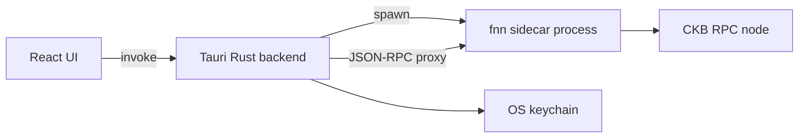

# Architecture

Technical overview of Fiber Desktop for contributors. For setup instructions, see [DEVELOPMENT.md](DEVELOPMENT.md).

## Overview

Fiber Desktop is a **Tauri 2** shell around the official **Fiber Network Node** (`fnn`). The React UI talks to a Rust backend via Tauri `invoke`; the backend spawns `fnn`, proxies JSON-RPC, and stores secrets in the OS keychain.

| Layer | Technology | Path |
|-------|------------|------|
| UI | React 19, Vite 7, TypeScript | [`app/src/`](../app/src/) |
| Shell | Tauri 2, Rust 2021 | [`app/src-tauri/`](../app/src-tauri/) |
| Node | `fnn` (pinned release binary) | Downloaded to `app/src-tauri/binaries/` |
| Protocol | [Fiber Network](https://www.fiber.world/docs) | Implemented by `fnn`, not this repo |

## Process model

[`FnnRuntime`](../app/src-tauri/src/fnn_runtime.rs) owns the child `fnn` process:

- **Start** — validates CKB key, config, and keychain password; spawns `fnn` with `-d` (data dir) and `-c` (config).
- **Logs** — tails stdout/stderr and emits `fnn-log-line` events to the frontend.
- **PID file** — writes `{data_dir}/fiber-desktop.pid` so an orphaned process can be **adopted** after the app restarts (`fnn_adopt_orphan`).
- **Stop** — terminates the child and clears runtime state.

Settings (paths, network, RPC URL) are persisted by [`settings.rs`](../app/src-tauri/src/settings.rs) under the app config directory.

## IPC commands

All commands are registered in [`lib.rs`](../app/src-tauri/src/lib.rs) and implemented in [`commands.rs`](../app/src-tauri/src/commands.rs).

| Group | Commands | Purpose |
|-------|----------|---------|
| Settings | `get_settings`, `save_settings` | Load/save `AppSettings` (network, paths, RPC URL) |
| Secrets | `set_fnn_secret_password`, `has_fnn_secret_password` | Keychain / Credential Manager / Secret Service |
| fnn lifecycle | `fnn_start`, `fnn_stop`, `fnn_status`, `fnn_logs`, `fnn_runtime_snapshot`, `fnn_adopt_orphan` | Process control and observability |
| Binary management | `pinned_fnn_info`, `download_pinned_fnn`, `fnn_binary_status`, `ensure_fnn_binary`, `use_bundled_fnn_binary` | Sidecar download and path resolution |
| Config | `install_upstream_fnn_config`, `apply_ckb_rpc_to_config_file`, `clear_config_bootnodes` | Sync FNN `config.yml` with app settings |
| CKB key | `prepare_ckb_key_folder`, `ckb_key_status`, `write_ckb_private_key` | `{data_dir}/ckb/key` helpers |
| RPC | `fiber_rpc_call` | HTTP JSON-RPC proxy to local `fnn` |
| Platform | `get_platform_labels` | OS-specific UI strings |

Custom app commands do not use Tauri plugin permission identifiers; they are exposed through the standard invoke handler. Plugin APIs (dialog, opener) are gated separately via capabilities (below).

## Security and Tauri ACL

Tauri 2 uses **capabilities** to limit what each window/webview can access. See the [Capability reference](https://v2.tauri.app/reference/acl/capability/).

[`app/src-tauri/capabilities/default.json`](../app/src-tauri/capabilities/default.json) applies to the `main` window:

| Permission | Purpose |
|------------|---------|
| `core:default` | Core Tauri APIs for the main window |
| `dialog:default` | Native file/folder dialogs |
| `opener:default` | Open URLs and paths |
| `opener:allow-open-path` (scoped) | Open paths under `$APPDATA`, `$APPLOCALDATA`, `$HOME`, `$DOCUMENT`, `$DOWNLOAD` |

Content Security Policy is set in [`tauri.conf.json`](../app/src-tauri/tauri.conf.json) (`app.security.csp`) to restrict `connect-src` and related directives in production builds.

**Trust model:** The node and CKB key run locally. Fiber Desktop is not a hosted wallet; users supply their own key file and keychain password.

## Frontend structure

| Area | Path | Notes |
|------|------|-------|
| Tabs | [`app/src/constants/appTabs.ts`](../app/src/constants/appTabs.ts) | Overview, Setup, Node, Channels, Agents, Receive, Send, Activity, Network |
| RPC client | [`app/src/lib/fiberRpc.ts`](../app/src/lib/fiberRpc.ts) | Wraps `fiber_rpc_call` |
| Node runtime hook | [`app/src/lib/useNodeRuntime.ts`](../app/src/lib/useNodeRuntime.ts) | Start/stop/status/logs |
| Guided setup | [`app/src/hooks/useGuidedSetup.ts`](../app/src/hooks/useGuidedSetup.ts) | First-run wizard |

## Data paths

| Path | Description |
|------|-------------|
| `{fnn_data_dir}` | User-chosen FNN data directory (`-d`); default suggested by guided setup |
| `{fnn_data_dir}/ckb/key` | CKB secp256k1 private key (hex, one line) |
| `{fnn_data_dir}/fiber-desktop.pid` | Adopted child PID |
| `{fnn_config_path}` | FNN `config.yml` (`-c`) |
| App config dir | Tauri app data; stores serialized `AppSettings` |

Network defaults: testnet CKB RPC `https://testnet.ckbapp.dev/`, fnn JSON-RPC `http://127.0.0.1:8227` (see [`settings.rs`](../app/src-tauri/src/settings.rs)).

## Shop agents

The **Agents** tab runs one or more background pollers that talk **outbound** to integrator backends, create invoices on local `fnn`, and submit results. Logic lives in [`shop_agents.rs`](../app/src-tauri/src/shop_agents.rs). Website integrators use [**fiber-peer-pay**](../../fiber-peer-pay) (`@fiber-peer-pay/node` + `@fiber-peer-pay/react`). See [SHOP-AGENTS.md](./SHOP-AGENTS.md).

## Marketing site

The [`marketing/`](../marketing/) package is a separate Vite + React Router static site. It fetches GitHub Releases for download links and hosts user-facing guides. It does not embed Tauri or `fnn`.

## CI and releases

- **CI** — [`.github/workflows/ci.yml`](../.github/workflows/ci.yml): lint/build marketing, `cargo fmt` / `clippy` / `test`, platform bundles on PRs.
- **Release** — [`.github/workflows/release.yml`](../.github/workflows/release.yml): tag `v*` → multi-platform installers on GitHub Releases.

See [CONTRIBUTING.md](CONTRIBUTING.md) and [RELEASE_QA.md](RELEASE_QA.md).
